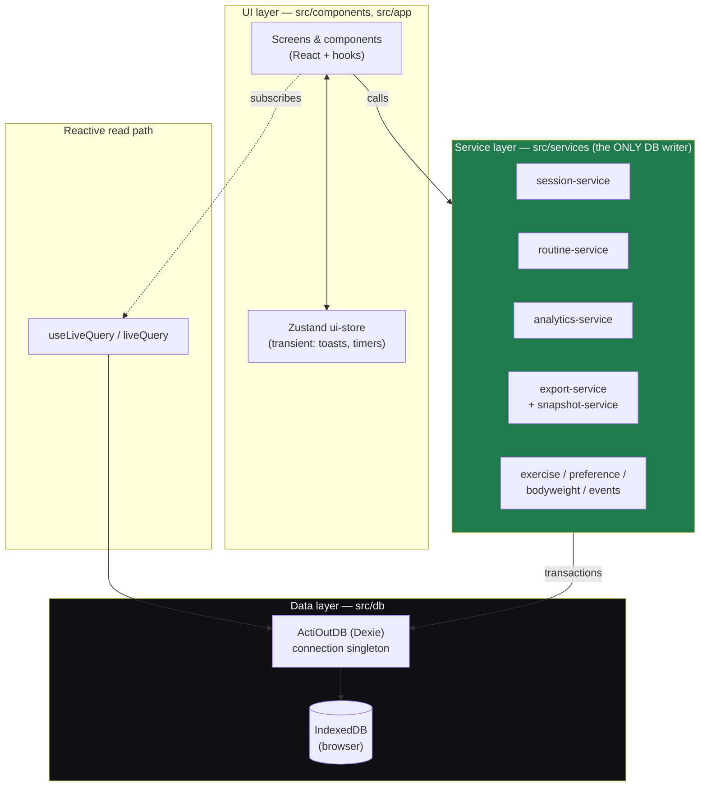

# ActiOut — Architecture

Reference architecture for ActiOut, a local-first, mobile-first workout tracker. This directory is the canonical, publishable description of the system: how it is layered, what the data model is, how the data-access layer works, and how the (future) sync and data-safety subsystems are designed.

> **Status.** This describes the **v2** target architecture defined in
> [`docs/superpowers/specs/2026-07-10-actiout-v2-design.md`](../docs/superpowers/specs/2026-07-10-actiout-v2-design.md).
> v1 (shipped, per-exercise aggregate logging) is the predecessor; v2 introduces
> per-set logging, a snapshot subsystem, and a recorded (not yet built) sync model.
> Where a section describes something not yet implemented, it says so explicitly.

## Documents

| File | What it covers |
|------|----------------|
| [`data-model.md`](./data-model.md) | Logical entities, relationships, ER diagram, and the invariants the service layer enforces. |
| [`ddl/relational-schema.sql`](./ddl/relational-schema.sql) | Forward-looking canonical schema as PostgreSQL DDL — the blueprint for the eventual centralized server. |
| [`ddl/indexeddb-stores.md`](./ddl/indexeddb-stores.md) | The **actual runtime schema**: Dexie/IndexedDB object stores and indexes as declared in code. |
| [`connection-layer.md`](./connection-layer.md) | The data-access layer: the Dexie connection singleton, initialization/seeding, transaction discipline, the service-API boundary, and error handling. |
| [`sync-architecture.md`](./sync-architecture.md) | The thin-client / single-writer sync model (decision recorded; **not built**), transport options, and known limitations. |
| [`data-safety.md`](./data-safety.md) | Snapshots and rollback, retention policy, storage durability, and the hardened import/restore path. |

## What ActiOut is

A single-user workout logger that runs entirely in the browser. No account, no required backend, no network dependency for core use. It installs as a PWA and works offline once cached. Its distinguishing feature is **sequence-position tracking**: the order exercises are actually performed is first-class data, so performance can be analyzed by position to account for fatigue.

## Technology stack

| Concern | Choice | Notes |
|---------|--------|-------|
| UI | React 18 + TypeScript (`strict`) | Function components + hooks. |
| Build / dev | Vite | `vite-plugin-pwa` for the service worker + manifest. |
| Persistence | IndexedDB via **Dexie** | The single source of truth on-device. |
| Reactivity over data | Dexie `liveQuery` + `useLiveQuery` | Screens subscribe to queries; writes propagate automatically. |
| Transient UI state | Zustand | Non-persistent (toasts, active timers, ephemeral flags). |
| Testing | Vitest + `fake-indexeddb` | Service/db tests run against a real IndexedDB implementation, no mocks. |

## Architectural principles

These are load-bearing; the rest of the architecture follows from them.

1. **Local-first, offline-always.** IndexedDB on the device is the source of truth. The app must be fully usable with no network. A centralized server, when it exists, is an *addition*, not a dependency.
2. **One layer owns persistence.** UI components never touch Dexie directly. All reads and writes go through the **service layer** (`src/services/*`), which is the only code that opens transactions. This keeps invariants (contiguous ordering, per-row unit stamping, event logging) in one place. See [`connection-layer.md`](./connection-layer.md).
3. **The user's data is irreplaceable.** There is exactly one copy and no server backup. Every destructive operation (import, restore, future sync overwrite) takes an automatic local **snapshot** first, and validates input **before** mutating. See [`data-safety.md`](./data-safety.md).
4. **Snapshots (weight + unit) travel with the data.** Session items and sets carry the exercise name, the routine name, and the weight unit as they were at the time — history stays truthful even after the source routine is edited or deleted. Weight is stored with its own `weight_unit` per row and converted only at read time.
5. **Ordering is first-class.** `sequence_position` (items within a session) and `set_number` (sets within an item) are explicit, contiguous, and maintained transactionally on insert/remove/reorder.
6. **Built for future sync without a rewrite.** Every entity has a UUID primary key and `created_at`/`updated_at`. That is the substrate a future sync needs; see [`sync-architecture.md`](./sync-architecture.md) for the chosen model and why the event log stays a lightweight audit trail rather than a merge oplog.

## Layered architecture



**Dependency rule:** arrows point downward only. UI depends on services and on the reactive read path; services depend on the Dexie data layer; nothing depends on the UI. The service layer is the sole writer — the read path (`liveQuery`) reads directly for reactivity, but every *mutation* is funneled through a service so invariants and event logging cannot be bypassed.

## Directory map (source)

```
src/
  app/          # shell: routes, tab bar, top-level App
  components/    # screens & presentational components (home, routines, session, progress, settings, common)
  services/      # THE data-access layer — all reads/writes, transactions, invariants, events
  db/            # Dexie class (schema), seed, connection singleton
  domain/        # pure types + unit conversion (no I/O)
  state/         # Zustand transient UI store
  utils/         # dates, ids (framework-free helpers)
```
