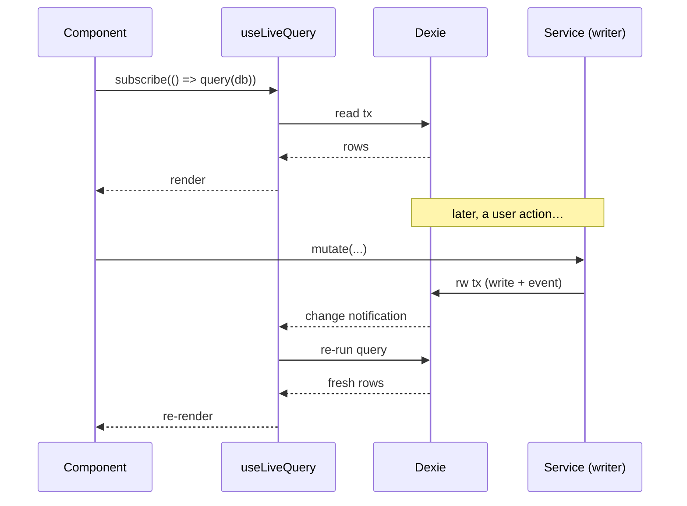

# Connection & Data-Access Layer

How the app talks to IndexedDB. This is the boundary between the durable store and everything above it. The rule the whole architecture leans on: **only this layer opens a database connection or a transaction — the UI never touches Dexie directly.**

## The connection singleton

The database is a single Dexie subclass, instantiated once, imported everywhere.

```ts
// src/db/schema.ts
export class ActiOutDB extends Dexie {
  preferences!: Table<Preference, string>;
  exerciseCatalog!: Table<ExerciseCatalogEntry, string>;
  // …one typed Table per store…
  sessionSets!: Table<SessionSet, string>;   // v2
  snapshots!: Table<Snapshot, string>;       // v2

  constructor(name = 'actiout') {
    super(name);
    this.version(1).stores({ /* …v1… */ });
    this.version(2).stores({ /* …v2, see ddl/indexeddb-stores.md… */ });
  }
}

export const db = new ActiOutDB();   // the singleton
```

- **One connection per tab.** Dexie manages the underlying `IDBDatabase`. Multiple browser tabs each open their own connection to the same named database (`'actiout'`); IndexedDB is shared across tabs of the same origin, which is why initialization is concurrency-safe (below) and why `liveQuery` can reflect another tab's writes.
- **Dependency injection for tests.** Every service function takes the database as a trailing parameter defaulting to the singleton — `fn(args, database: ActiOutDB = db)`. Tests pass a fresh `fake-indexeddb`-backed instance; production passes nothing. This is why the suite needs no mocks: it exercises real IndexedDB semantics (transactions, unique-index rejections, cursor order).

## Initialization & seeding

`initializeDb(database = db)` runs once at startup (`src/main.tsx`) before React renders. It is **idempotent** and **concurrency-safe**:

1. If the `'default'` preferences row exists, seeding already happened — return immediately.
2. Otherwise, in one `rw` transaction, `add` the default preference and `bulkAdd` the 40 starter exercises.
3. If two cold tabs race and both pass step 1, the loser's `add`/`bulkAdd` violates a unique key (`preferences.id` or `exerciseCatalog.&normalizedName`) and throws `ConstraintError`. That is caught, the winner is confirmed present, and the error is swallowed — the same catch-the-race idiom used by `getPreferences` and `ensureExercise`. A genuine failure (winner absent) is rethrown.

Two rules this encodes, both learned from prior bugs:

- **`add`, never `put`.** A concurrent double-seed must never overwrite a user's real preferences.
- **`main.tsx` renders even if `initializeDb` rejects.** A partially-seeded app beats a blank screen. Startup wraps the call in try/catch and mounts React regardless.

> On the first launch under **v2**, because the schema is declared fresh with no upgrade function (wipe-and-reseed), the store is empty and `initializeDb` seeds it exactly as on a first-ever launch. See [`ddl/indexeddb-stores.md`](./ddl/indexeddb-stores.md#migration-strategy).

## The service layer (the only writer)

`src/services/*` is the entire data-access API. Each service owns one aggregate:

| Service | Owns | Representative operations |
|---|---|---|
| `preference-service` | preferences singleton | get (create-on-miss, race-safe), update |
| `exercise-service` | exercise catalog | normalize name, typeahead search, `ensureExercise` (get-or-create, race-safe) |
| `routine-service` | routine templates (+ days, items) | create/update/delete, hydrate, list, reorder items |
| `session-service` | sessions (+ links, items, **sets**) | start (routine/quick/backfill), per-set CRUD, reorder, finish/DNF, edit completed |
| `analytics-service` | read-only projections | PRs, sequence stats, history, consistency, bodyweight trend, last-time prefill |
| `bodyweight-service` | bodyweight entries | add, delete |
| `export-service` | whole-DB bundle | export, validate, import (replace-all), **+ snapshot-service** |
| `events` | app-events audit log | `logEvent` |

### Contract every mutating service function honors

- **Hydration boundary.** Nested aggregates (a `Session` with its links, items, and sets) are stored flat across child stores and *reassembled* on read by a `hydrate` function that sorts children into their canonical order (links by `sourceSequence`, items by `sequencePosition`, sets by `setNumber`). Callers receive a fully-formed domain object and never see the row split.
- **Snapshots on write.** When creating a session from a routine, the routine's name, the exercise names, defaults, and rest values are **copied** into the session's rows. Later edits to the routine cannot alter history (INV-6).
- **Per-row unit stamping.** Any write of a weight also writes its `weight_unit`; weight is never converted on write (INV-5).
- **Ordering maintained transactionally.** Insert/remove/reorder of items or sets renumbers siblings to stay contiguous, inside the same transaction (INV-2, INV-3).
- **Events inside the transaction.** A lifecycle mutation appends its `app_events` row in the *same* transaction, so a rollback logs nothing and a no-op logs nothing (INV-8).

## Transaction discipline

- **Every multi-row mutation runs in an explicit `db.transaction('rw', …stores, fn)`.** This is what makes operations atomic — the class of bug the final v1 review found (a destructive `clear()` that committed before its follow-up write failed) is prevented by keeping clear+write in one transaction that rolls back as a unit.
- **Enroll every store the operation touches**, including `appEvents` when it logs. Dexie throws if a transaction touches an unenrolled store — a useful guardrail.
- **Reads for reactivity go direct.** The read path uses Dexie `liveQuery`, which runs its own read transactions and re-emits when any touched store changes. Hydration reads that must be internally consistent should run inside a transaction; a known v1 caveat is that `hydrate` currently issues its child reads non-transactionally, which is benign for a single-writer app but is the place to add a read transaction if stricter consistency is ever needed.

## Reactive reads



Components call a service to **write**, and subscribe via `useLiveQuery` to **read**. They never hold their own copy of persistent state as the source of truth; the store is. This is why a write on one screen (or another tab) updates every subscribed view without manual refresh.

## Error handling

- **Typed domain errors** for expected conditions the UI must handle — e.g. `DraftExistsError` (carrying the blocking draft id) when starting a session while a draft exists. The UI catches these and drives the draft-conflict flow.
- **Race conditions are caught, not prevented by locking.** `ConstraintError` on a unique index is the concurrency primitive (see initialization, `ensureExercise`, `getPreferences`). The pattern is always: attempt the write, catch the constraint violation, resolve to the existing winner.
- **Validation before destruction.** `import`/`restore` validate row shape and referential integrity *before* clearing anything, and snapshot first. See [`data-safety.md`](./data-safety.md).

## Event log

`logEvent(entityType, entityId, eventType, payload?, database)` appends one `app_events` row (`payload` JSON-stringified; `'null'` when omitted). It is a **lightweight lifecycle audit trail**, not a source of truth and not a mergeable oplog:

- **Logged:** session started/completed/dnf, routine created/updated/deleted, bodyweight created/deleted, import, restore, snapshot-created.
- **Not logged:** per-set field edits, item add/move/remove (the v1 `item-*` events are removed — they recorded that something changed without recording what it became, serving neither audit nor replay).
- Nothing in the app currently *reads* the log; it exists for history/debugging and as a deliberate, minimal hook. The rationale for keeping it minimal — rather than growing it into a sync oplog — is in [`sync-architecture.md`](./sync-architecture.md).
