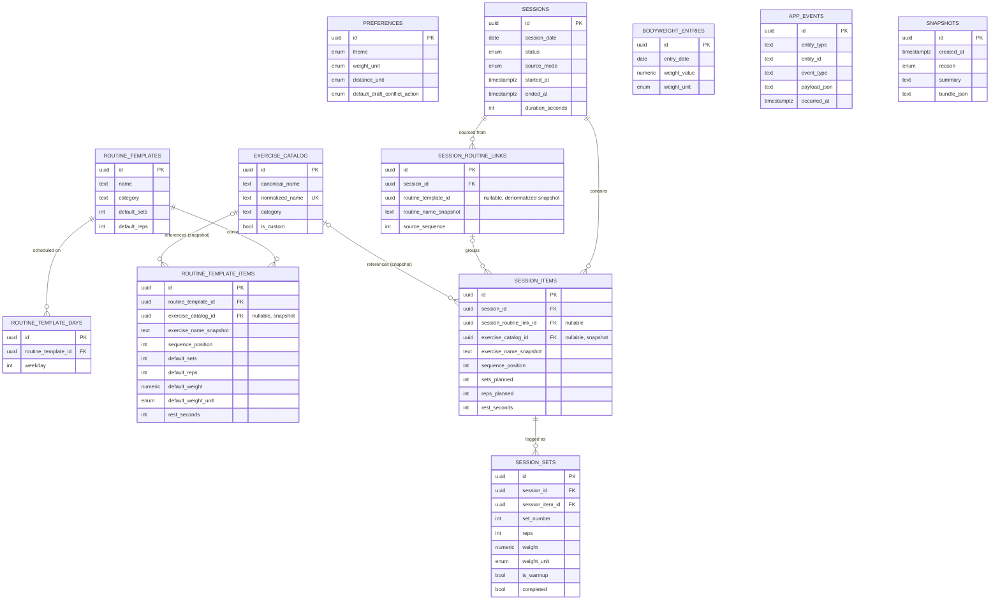

# Data Model

The v2 logical data model. This is the shape the service layer maintains and the DDL formalizes. Two physical realizations exist:

- **Runtime:** IndexedDB object stores via Dexie — see [`ddl/indexeddb-stores.md`](./ddl/indexeddb-stores.md).
- **Future server:** relational tables — see [`ddl/relational-schema.sql`](./ddl/relational-schema.sql).

Both realize the *same* logical model described here.

## Core concepts

- **Routine** — a saved template: an ordered list of exercises with default sets/reps/optional weight, day-of-week assignments, and per-item rest. Templates and live sessions are separate concepts; editing or deleting a routine never mutates past sessions.
- **Session** — one actual workout on a date. Sourced from one or more routines (`sourceMode = 'routine'`) or started ad-hoc (`sourceMode = 'quick'`). Has a lifecycle: `draft → completed | dnf`.
- **Session item** — an exercise *slot* within a session, at a `sequence_position`. Carries planned targets and rest, **but not the actual work**.
- **Session set** — one performed set within an item: reps, weight (+unit), warmup flag, completed flag. **This is where actual logged work lives in v2** (v1 stored aggregates on the item).
- **Bodyweight entry** — a dated bodyweight measurement.
- **App event** — an append-only lifecycle audit record (see [`connection-layer.md`](./connection-layer.md#event-log) and [`sync-architecture.md`](./sync-architecture.md)).
- **Snapshot** — a device-local, compressed backup of the whole dataset, taken before destructive operations (see [`data-safety.md`](./data-safety.md)).

## Entity–relationship diagram

## Relationships and delete behavior

| Relationship | Cardinality | On delete of parent |
|---|---|---|
| routine_template → routine_template_days | 1‑to‑many | cascade |
| routine_template → routine_template_items | 1‑to‑many | cascade |
| session → session_routine_links | 1‑to‑many | cascade |
| session → session_items | 1‑to‑many | cascade |
| session_item → session_sets | 1‑to‑many | cascade |
| exercise_catalog → routine_template_items / session_items | 1‑to‑many, **nullable** | set null (name snapshot preserved) |
| routine_template → session_routine_links | (weak) | **no cascade** — link keeps `routine_name_snapshot`; `routine_template_id` may dangle |

### Two deliberate "dangling" references

These are **not** integrity bugs; they are intentional denormalized snapshots, and the import/restore validator explicitly permits them (see [`data-safety.md`](./data-safety.md#referential-validation)):

1. **`session_routine_links.routine_template_id`** — routines are **hard-deleted**, but a session performed from that routine must keep its history. The link retains `routine_name_snapshot`; the id may reference a routine that no longer exists.
2. **`*.exercise_catalog_id`** (routine items and session items) — nullable. The `exercise_name_snapshot` is authoritative for display; the catalog link is a convenience that may be absent (custom/ad-hoc exercises) or point to a since-changed catalog row.

## Invariants (enforced by the service layer, not the store)

IndexedDB enforces only primary keys and declared unique indexes. Everything below is maintained in `src/services/*` inside transactions. A future relational server would express most of these as constraints (see the DDL).

- **INV-1 — Single active draft.** At most one session with `status = 'draft'` exists at any time. Enforced inside the session-create transaction.
- **INV-2 — Contiguous item ordering.** Within a session, `sequence_position` is `1..n` with no gaps; removing or reordering an item renumbers the rest in the same transaction.
- **INV-3 — Contiguous set ordering.** Within an item, `set_number` is `1..m` with no gaps; same renumber-on-mutate rule.
- **INV-4 — Derived item completion.** An item is "done" iff it has ≥1 set and all its **non-warmup** sets are `completed`. This is computed, never stored — v1's stored `completed` flag (which could disagree with reality) is removed.
- **INV-5 — Per-row unit stamping.** Every row that stores a weight (`session_sets`, `routine_template_items.default_weight`, `bodyweight_entries`) also stores its own `weight_unit`. Weight is **never** converted on write; conversion happens only at read/display time. This prevents lb→kg→lb drift.
- **INV-6 — History immutability under template change.** Editing or deleting a routine template never alters existing sessions, because sessions copy names and defaults as snapshots at creation.
- **INV-7 — Warmups excluded from analytics.** Sets with `is_warmup = true` are stored and shown in history but excluded from volume, PRs, and sequence stats.
- **INV-8 — Lifecycle events are transactional.** An `app_events` row is written **inside** the same transaction as the mutation it records; a rolled-back mutation logs nothing, and no event is logged for a no-op (e.g. deleting a non-existent id).

## Enumerations

| Enum | Values | Used by |
|---|---|---|
| `weight_unit` | `lb`, `kg` | sets, routine item default weight, bodyweight |
| `session_status` | `draft`, `completed`, `dnf` | sessions |
| `source_mode` | `routine`, `quick` | sessions |
| `theme` | `system`, `light`, `dark` | preferences |
| `distance_unit` | `mi`, `km` | preferences |
| `draft_conflict_action` | `ask`, `resume`, `close-and-start-new` | preferences |
| `snapshot_reason` | `pre-import`, `pre-restore`, `pre-sync`, `manual` | snapshots |
| `weekday` | integer `0`–`6`, `0 = Sunday` | routine_template_days |

## Removed from v1 (documented so the change is explicit)

- **`session_items.sets_actual / reps_actual / weight_actual / weight_unit / completed`** — actual work moved to `session_sets`.
- **`routine_templates.is_archived`** — no feature ever set it; the boolean index was inert in IndexedDB. Routines are hard-deleted.
- **`preferences.confirm_before_replacing_draft`** — redundant with `default_draft_conflict_action = 'ask'`.

## Not modeled locally (future server only)

The local model has **no `users` table and no `user_id`**, by design — ActiOut is single-user and account-free on-device. A future multi-tenant server would add those; that extension is described in an appendix of [`ddl/relational-schema.sql`](./ddl/relational-schema.sql) and deliberately kept out of the local schema to avoid the dead-column drift v1 had.
