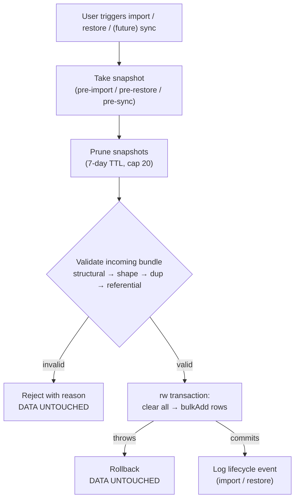

# Data Safety: Snapshots, Durability, and Hardened Import

ActiOut holds the user's only copy of their data, on one device, with no server backup. This subsystem exists so that a mistake, a bad import, or a future sync overwrite cannot silently and irreversibly destroy it. Three mechanisms: **validate before destroying**, **snapshot before destroying**, and **keep the store from being evicted**.

## Threat model

What we are protecting against, concretely:

1. **A malformed import wipes everything.** (This was the Critical finding in the v1 final review: `import` cleared all tables, then discovered the incoming rows were garbage — and because IndexedDB validates only primary keys, nothing threw and nothing rolled back.)
2. **The user makes a mistake they notice later** — a bad import, a restore of the wrong bundle, or (future) a sync that overwrote the device they meant to keep.
3. **The browser silently evicts IndexedDB** under storage pressure, discarding everything.

## Mechanism 1 — Validate before destroying

`import` and `restore` never clear the database until the incoming bundle has passed full validation. Validation is **structural + shape + referential**, in that order, and produces a specific, human-readable reason on failure.

### Bundle format

The export bundle (`ExportBundle`, `formatVersion: 2` in v2) is a JSON object with one array per exported table. `snapshots` is **excluded** — snapshots are a device concern, not user data. Import/restore is **replace-all**: the bundle is the complete dataset, not a merge.

### Validation stages

1. **Structural.** `formatVersion` is the expected version; every table field is present and is an array. A `formatVersion: 1` (v1) bundle is rejected with a clear message — there is no v1 user data to preserve (wipe-and-reseed).
2. **Row shape.** Each row is a non-null object; every *required* field has the right type and, for enums, an allowed value. Optional fields are not checked; unknown extra fields are tolerated. The required-field map is derived from the [data model](./data-model.md); the check is table-driven (one `FieldCheck` map, not ten hand-written validators).
3. **Duplicate keys.** No table may contain two rows with the same `id` (a duplicate would otherwise surface only as a mid-transaction `bulkAdd` throw).
4. **Referential integrity.** Child rows must reference a present parent:

### Referential validation

Enforced (reject if the parent id is absent):

- `routineTemplateDays.routineTemplateId` → `routineTemplates.id`
- `routineTemplateItems.routineTemplateId` → `routineTemplates.id`
- `sessionRoutineLinks.sessionId` → `sessions.id`
- `sessionItems.sessionId` → `sessions.id`
- `sessionSets.sessionId` → `sessions.id`
- `sessionSets.sessionItemId` → `sessionItems.id`

**Deliberately NOT enforced** (these legitimately dangle — enforcing them would reject a valid backup):

- `sessionRoutineLinks.routineTemplateId` — routines are hard-deleted while the session's snapshot link survives; a real user's backup will reference a deleted routine.
- `*.exerciseCatalogId` (routine items, session items) — optional snapshot link; the name snapshot is authoritative.

See [data-model § deliberate dangling references](./data-model.md#two-deliberate-dangling-references).

### Atomicity

The actual replace runs in a single `rw` transaction spanning every table: `clear()` each, then `bulkAdd` the validated rows. Any failure rolls back the whole transaction, so the pre-import data survives. `importBundle` also **re-validates defensively** at its own entry point (it is reachable directly, e.g. via the dev hook), throwing before touching the transaction if handed an invalid bundle.

## Mechanism 2 — Snapshot before destroying

A **snapshot** is a compressed, device-local copy of the entire dataset, taken automatically and synchronously *before* any whole-DB destructive operation.

### The `snapshots` store

| Field | Meaning |
|---|---|
| `id` | UUID |
| `created_at` | when taken |
| `reason` | `pre-import` \| `pre-restore` \| `pre-sync` \| `manual` |
| `summary` | human summary, e.g. `"8 routines, 142 sessions, 30 bodyweight"` |
| `bundle_json` | a compressed `ExportBundle` (gzip via `CompressionStream` where available; plain JSON string fallback) |

### When a snapshot is taken

- before an **import** (`pre-import`),
- before a **restore** (`pre-restore`) — yes, even restoring is reversible,
- before a future **sync overwrite** (`pre-sync`),
- and at the **start of every future sync session**.

There is no time-based cadence: the trigger is always "about to replace everything," which is exactly when a rollback point has value.

### Retention

- **Age-based TTL of 7 days.** On each snapshot creation, snapshots older than 7 days are pruned. Sync twice in a day → two that day; return after a month → all gone, which is correct (a month-old restore point can only conflict with everything since).
- **Hard cap of 20.** If a pathological burst would exceed 20, the oldest beyond the cap are pruned regardless of age — a guard against exhausting the storage quota.

### Restore

Settings → **Restore from snapshot** lists snapshots (date, reason, summary). Restoring:

1. takes a `pre-restore` snapshot of the current state,
2. decompresses and **validates** the chosen bundle through the same path as import,
3. replaces all data in one transaction.

So a restore is itself undoable, and a corrupt snapshot cannot destroy the current data.



## Mechanism 3 — Storage durability

On startup the app requests persistent storage:

```ts
if (navigator.storage?.persist) {
  const persisted = await navigator.storage.persist();
  // log granted/denied; surface a one-line note in Settings if denied
}
```

Without a persistence grant, browsers (notably Safari) may **evict** IndexedDB under storage pressure — which would defeat every other measure here. The grant is best-effort (the browser may deny), so Settings surfaces the status and the export/snapshot features remain the ultimate backstop. This runs alongside `initializeDb` at startup and never blocks rendering.

## What is NOT protected

Stated plainly so expectations are honest:

- Snapshots are **on the same device** as the data. A lost or wiped device loses its snapshots too. The defense against that is **export** (a file the user stores elsewhere) — snapshots defend against *user error*, export defends against *device loss*.
- There is no automatic off-device backup in this phase. That is the job of the future centralized server (see [`sync-architecture.md`](./sync-architecture.md)).
