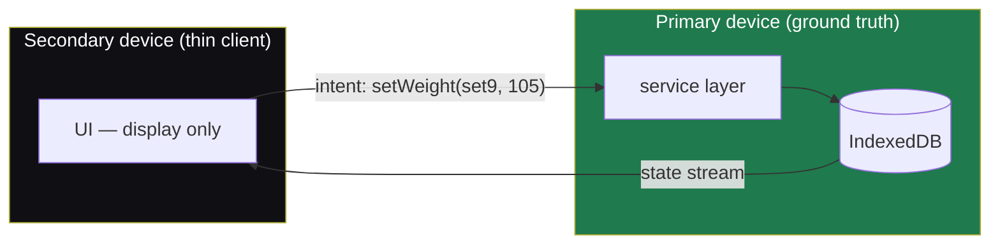

# Sync Architecture

> **Status: DECISION RECORDED, NOT BUILT.** Nothing in this document is implemented. It exists so the data model and connection layer don't foreclose it, and so the implementation phase doesn't over-build. Sync is an explicit **stopgap** until a centralized database / real-time relay exists; it is designed to be discarded cleanly when that server arrives.

## The problem sync has to solve

ActiOut stores the user's only copy of their data in IndexedDB on one device. Using it on a second device means two databases that can diverge while offline. The hard part of sync is never *storing* what the user did — that is an append to a table. The hard part is **reconciling two devices that both changed things** and then meet. For mutable records (edit set 2's weight, backfill Tuesday's session), naive "newest wins" silently discards one side's change.

Most local-first apps answer this with heavy machinery — per-field oplogs, CRDTs, version vectors — because they allow **multiple concurrent writers**. ActiOut deliberately avoids that machinery by removing the premise.

## The chosen model: thin-client, single-writer

One device is the **primary** and holds ground truth. Another device is a **thin client**, not a replica:

- The thin client stores nothing authoritative.
- Over a **live connection**, it sends **intents** ("add a set", "set weight = 105", "mark set done") to the primary.
- The primary applies each intent to its own IndexedDB (through the normal service layer), and the resulting state **streams back** to the thin client for display.
- Changes propagate in **real time while connected**. If the connection drops, nothing propagates — an honest, visible failure mode, not silent data loss.

### Why this collapses the complexity

There is **exactly one writer** (the primary's service layer). Two devices can never independently mutate the same record, so:

- **no merge** is ever required;
- therefore **no oplog, no CRDT, no version vectors, no reconciliation policy**;
- therefore the [event log stays a lightweight audit trail](./connection-layer.md#event-log) rather than a per-field change stream.

This is the same property that made early WhatsApp Web robust: the phone was the source of truth and the browser was a thin mirror — phone offline meant the mirror was inert. The QR code in that system was **pairing** (identity + keys), not reconciliation; reconciliation was avoided by never having two writers.

## Consequences and constraints (for the future implementer)

These are recorded now because they shape the eventual transport choice, not because they block anything today.

- **The primary must be awake and reachable while the secondary is in use.** This is acceptable: the common case is logging on one phone; cross-device logging is the rare case.
- **iOS Safari suspends background PWA pages aggressively.** A locked phone will drop the data channel. So *phone-primary, desktop-secondary* likely requires the phone foregrounded; *desktop-primary* sidesteps it because desktops stay awake. Design the role model so the more-available device can be primary.
- **First pairing of two already-populated devices** still needs a one-time answer (which becomes primary; the other becomes a thin client and its local data is set aside). A pre-pairing [snapshot](./data-safety.md) covers the "wrong device won" mistake.
- **Data safety is orthogonal and already handled.** Before any future sync overwrite, a `pre-sync` snapshot is taken (see [`data-safety.md`](./data-safety.md)).

## Transport (deliberately deferred)

The reconciliation model above is independent of *how* bytes move. Options, to be chosen when sync is actually built:

| Transport | Sketch | Note |
|---|---|---|
| QR-initiated **WebRTC** | Encode the connection offer in a QR the secondary scans; establish a peer data channel; no server. | Best fit for "no backend" and real-time intents. |
| **File handoff** | Export bundle over AirDrop / file share, import on the other device. | Already possible today via export/import (whole-DB replace). The crude, working stopgap. |
| **Tiny relay** | A minimal signaling/relay server. | Smallest step toward the eventual centralized server. |

Until a transport is built, the **export/import bundle is the only sync mechanism**, and it is whole-DB replace (destructive), guarded by validation + snapshot.

## What "the real thing" looks like (out of scope, noted for direction)

The permanent answer is a **centralized server or a real-time sync backend**, at which point this thin-client stopgap is retired. The data model is already prepared for it:

- every entity has a **client-generated UUID** primary key → no id remapping on upload;
- every mutable row has **`created_at` / `updated_at`**;
- the [relational DDL appendix](./ddl/relational-schema.sql) sketches the multi-tenant extension (a `users` table, `user_id` FKs, a per-user `server_seq` for pull-since, and `deleted_at` tombstones for propagating deletes).

That is the "architected so future sync can be added without rebuilding the core model" principle from the product brief, made concrete.
